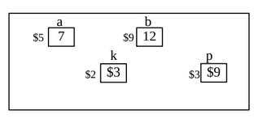
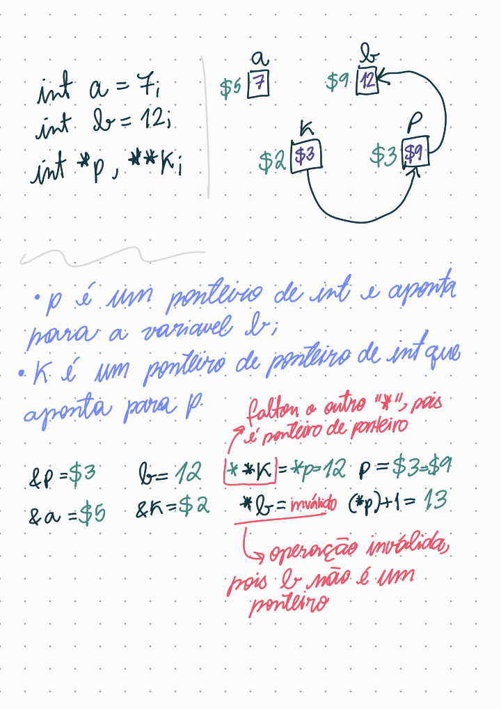
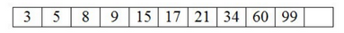
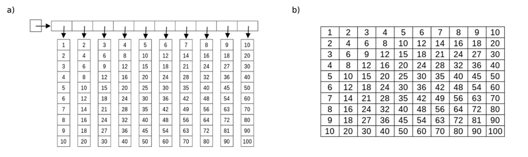
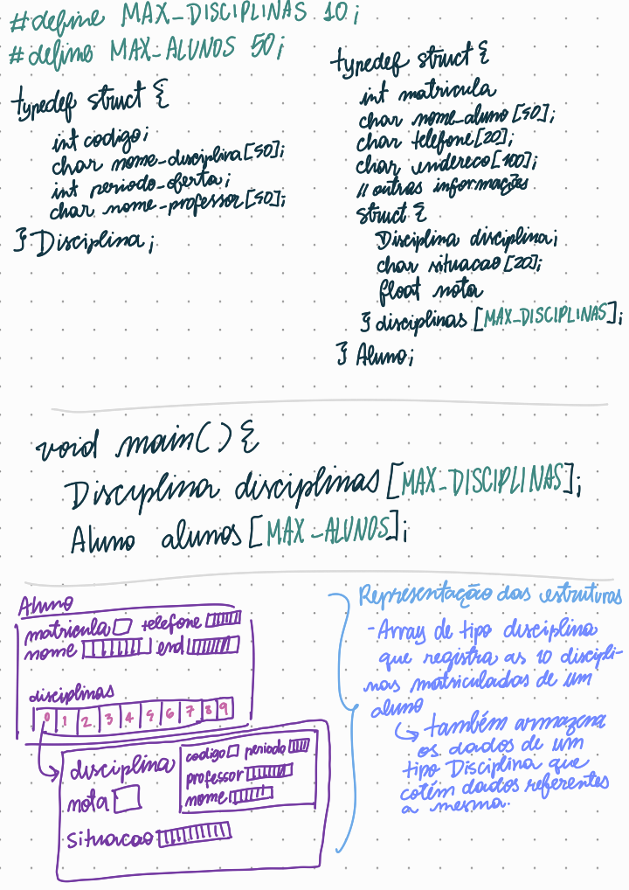
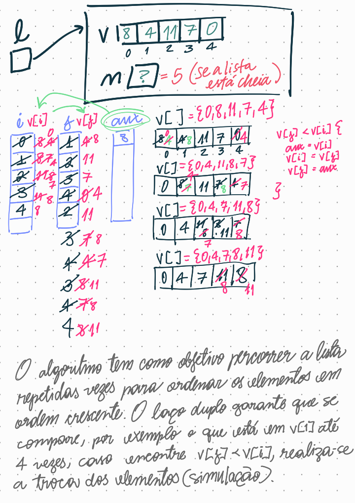

# Estrutura de Dados
## Unidade 1
### 📚 Prova
> Questões com implementação: 2, 4, 5, 6, 8 e 9.

#### 1. O que é uma estrutura de dados e qual a sua importância?
Uma estrutura de dados é uma forma de organizada e armazenar e gerenciar dados da memória principal de um computador de forma eficiente, ou seja, com velocidade, segurança e econimia de recursos. 

#### 2. De acordo com o diagrama ao lado, indique o valor de:



* Observação: `printf("%p\n", *k);`, sendo assim, `*k` contém o endereço de `b`.

#### 3. Quais as vantagens em utilizar a alocação dinâmica em vetores ao invés da alocação estática?
A alocação dinâmica de vetores permite que o tamanho do vetor seja definido em tempo de execução, enquato que na alocação estática o tamanho é definido em tempo de compilação. Algumas das vantagens da alocação dinâmica de vetores sobre a alocação estática são:
* **flexibilidade** para a  alteração do tamanho do vetor em tempo de execução;
* **economia de memória**, pois permite-se haja a alocação de memória necessária;
* **melhor gerenciamento de memória** ao realizar a liberação de memória alocada para uma vetor quando ela não é mais necessária;
* **segurança**, porque é possível verificar se a memória foi alocada corretamente antes de acessar seus elementos e isso pode ajudar a evitar erros de acesso à memória não alocada. 

#### 4. Observe a lista ordenada abaixo e escreva todas as linhas de código necessárias para inserir o valor 18. Declare todas as variáveis que julgar necessárias. Suponha que a lista está implementada utilizando vetor estático.


A definição da estrutura lista estática:
```c
#define TAM 11

struct lista {
  int v[TAM];
  int controle;
};
```
Protótipos
```c
int criarLista(struct lista *);
int inserir(struct lista *, int);
```
Implementação da função de inserir elementos de forma ordenada. 
```c
int inserir(struct lista *pl, int valor) {
  // Verificando se a lista está cheia
  if(pl->controle == TAM) {
    printf("A lista está cheia, não é possível inserir");
    return 0;
  }

  // i corresponde a posição que vou inserir o elemento corretamente
  int j, i = 0;
  while(i < pl->controle && pl->v[i] < valor) 
    i++;

  // Percorrendo a lista e fazendo a movimentação para então inserir;
  for(j = pl->controle - 1; j >= i; j--) {
    pl->v[j+1] = pl->v[j];
  }
  pl->v[i] = valor;
  pl->controle++;

  printf("Elementos inseridos com sucesso!\n");

  return 1;
}
```
Simulação da função que insere elementos:

#### 5. Para (a) e (b) defina as variáveis, alocando-as estatica ou dinamicamente em memória, de acordo com cada caso.


Lembrando que a constante `TAM` vale 10.

##### a. Alocação Dinâmica
* Alocar memória para as linhas e colunas da matriz;
* Preencher a matriz[i][j] = (j+1) * (i+1), com i e j possuindo um intervalo de [0, 10];
* Por último, liberar a memória alocada para as colunas e linhas, nesta ordem.
```c
void main() {
  int **matriz;
  int i, j;
  int x1 = 2, x2 = 6;

  // alocando memória para cada as 'linhas' e 'colunas' da matriz
  matriz = (int **) malloc(TAM * sizeof(int *));
  for(i = 0; i < TAM; i++) {
    matriz[i] = (int *) malloc(TAM * sizeof(int));
  }

  // <<< operações com a estrutura dinâmica >>>

  // liberando a memória das 'colunas' e então das 'linhas' da matriz
  for(i = 0; i < TAM; i++) {
    free(matriz[i]);
  }
  free(matriz);
}
```

##### b. Alocação Estática
* Criação de uma estrutura lista que possui uma matriz inteira[TAM][TAM] e inteiro de controle de inserção de elementos;
* Verificações básicas: verificar se foi criado, verificar se está cheia, inserir elementos e acessar matriz[x1][x2];

```c
void main() {
  struct listaB l;
  int x1 = 2, x2 = 6;
  
  criarLista(&l); // pl->oc = 0
  inserir(&l);
  
  printf("%d * %d = %d\n", x1, x2, tabuada(&l, x1, x2)); // resultado esperado: 12
}
```

#### 6. Supondo que em (a) e (b) os valores já estão preenchidos (observe que é uma tabuada!), escreva as linhas de código necessárias para retornar o valor da multiplicação de dois números entre 1 e 9 dados pelo usuário. Não faça a multiplicação, retorne apenas o valor de acordo com cada forma de armazenamento.
As operações de inserção e retorno de elementos (tabuada) será semelhante para ambas formas de alocamento das matrizes.
```c
// preenchimento padrão para ambos os tipos de alocações
matriz[i][j] = (j+1)*(i+1);

// acesso padrão das colunas e linhas para obter um elemento lembre o produto de x1 e x2;
return (matriz[linha-1][coluna-1]);
```
##### a. Alocação Dinâmica
```c
void main() {
  // <<< alocamento de memória aqui >>> (item 5.a)

  for(i = 0; i < TAM; i++) {
    for(j = 0; j < TAM; j++) {
      matriz[i][j] = (j+1)*(i+1);
    }
  }

  // tabuada, x1 = 2 e x2 = 6
  printf("%d * %d = %d\n", x1, x2, tabuada(matriz, x1, x2)); // resultado esperado: 12

  // <<< liberaçaõ de memória aqui >>> (item 5.a)
}

int tabuada(int **matriz, int linha, int coluna) {
  if(matriz == NULL) return 0;
  return (matriz[linha-1][coluna-1]);
}
```
##### b. Alocação Estática
```c
void main() {
  // variáveis e criação da estrutura (item 5.b)

  inserir(&l);
  
  printf("%d * %d = %d\n", x1, x2, tabuada(&l, x1, x2)); // resultado esperado: 12
}

// implementação de funções
int criarLista(struct listaB *pl) {
  pl->oc = 0;
  return 1;
}

int inserir(struct listaB *pl) {
   // Verificando se a lista está cheia
  if(pl->oc == TAM) {
    printf("A lista está cheia, não é possível inserir");
    return 0;
  }

  for(int i = 0; i < TAM; i++) {
    for(int j = 0; j < TAM; j++) {
      pl->v[i][j] = (j+1)*(i+1);
      pl->oc++;
    }
  }

  printf("Elementos inseridos com sucesso!\n");

  return 1;
}

int tabuada(struct listaB *pl, int linha, int coluna) {
  return (pl->v[linha-1][coluna-1]);
}
```

#### 7. Dado o seguinte problema: você precisa armazenar em memória as informações pessoais dos 50 alunos de um curso da UFPB, como número de matrícula, nome, telefone, endereço, etc., bem como informar a situação dele em cada uma de 10 disciplinas e sua nota. Neste caso, as disciplinas contêm um código, nome, período de oferta e nome do professor responsável. Codifique em C o(s) tipo(s) de dado e variáveis necessário(s) para armazenar as informações deste problema. Explique sua ideia.



#### 8. Implemente uma função que tenha como valor de retorno a soma de todos os elementos de uma lista implementada com vetor de 100 posicoes. Esta função deve obedecer ao protótipo `int soma_todos(struct lista*);`. Defina todas as variáveis e tipos que utilizar.

É necessário, antes de tudo, criar a lista, verificar se ela não está cheia e inserir os elementos. Optei por preencher todas as 100 posições da lista com o número 5 com uma fução semelhente a que foi utilizada na questão 4. 

Sendo assim, a implementação da função `soma_todos(struct lista *)` fica:

```c
int soma_todos(struct lista *pl) {
  int soma = 0; 
  for(int i = 0; i < TAM; i++) {
    soma += pl->v[i];
  }

  return soma;
}
```

#### 9. Simule e diga o que faz (ou deveria fazer) o código abaixo. Só vale nota COM a tabela e a simulação). Caso encontre erro, aponte-o.
> Suponha a lista com 5 elementos com valores 8, 4, 11, 7 e 0.
```c
struct lista {
  int valor[5];
  int n;
  } l;

int i, j, aux;
for (i=0; i<l.n-1; i++) {
  for (j=i+1; j<=l.n; j++) {
    if (l.valor[j]<l.valor[i]) {
      aux = l.valor[i];
      l.valor[i] = l.valor[j];
      l.valor[j] = aux;
    }
  }
}
```

