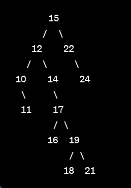
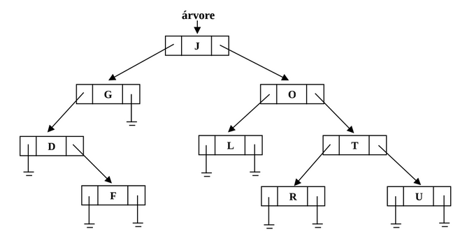

# Estrutura de Dados
## Unidade 3
### 📚 Prova

#### 1) O que são as listas heterogêneas? Elas são realmente heterogêneas? Explique.

Listas heterogêneas são estruturas de dados que permitem armazenar elementos de tipos diferentes em uma mesma lista. Essa heterogeneidade refere-se ao fato de que os elementos podem ter tipos distintos, como inteiros, caracteres, strings, ponteiros, entre outros. A lista em si não é heterogênea no sentido de que todos os elementos são tratados da mesma forma pela lista. A heterogeneidade está relacionada aos diferentes tipos de elementos que podem ser armazenados na lista.

#### 2) Qual a relação do tipo void com as listas heterogêneas?

O tipo void é frequentemente utilizado em listas heterogêneas como um tipo genérico para representar elementos de diferentes tipos. O void é um tipo especial em C que representa a ausência de tipo. Ele é usado para indicar que um ponteiro ou uma função não tem um tipo específico. Nas listas heterogêneas, um ponteiro do tipo void* pode ser usado para armazenar referências a elementos de diferentes tipos, já que um ponteiro void* pode ser convertido para qualquer outro tipo de ponteiro. Isso permite que as listas heterogêneas armazenem elementos de tipos diferentes, pois o ponteiro void* não possui um tipo específico.

#### 3) O que são e quais as características das estruturas de dados do tipo árvore, particularmente as árvores binárias?

As estruturas de dados do tipo árvore são estruturas hierárquicas que organizam os elementos de forma hierarquizada, seguindo um conjunto de regras. As árvores binárias são um tipo específico de árvore em que cada nó pode ter no máximo dois filhos, chamados de filho esquerdo e filho direito. Cada nó armazena um elemento (valor) e faz referência aos seus filhos. As principais características das árvores binárias incluem:

  * Cada nó pode ter no máximo dois filhos.
  * Existe um nó especial chamado nó raiz que é o ponto de partida da árvore.
  * Cada nó pode ter um filho esquerdo e/ou um filho direito.
  * A ordem dos elementos na árvore segue uma relação de ordem definida, onde os elementos menores são armazenados à esquerda e os elementos maiores são armazenados à direita.
  * As árvores binárias podem ser percorridas de diferentes maneiras, como in-order, pre-order e post-order.

As árvores binárias são amplamente utilizadas em várias aplicações, como estruturas de busca eficientes, implementação de expressões matemáticas, estruturas de dados para organização e busca de informações, entre outros.

#### 4) Neste exercício:

##### a) Escreva a função para inserir elementos em uma árvore de busca binária (ordenada). Utilize recursão e o protótipo apresentado.

```c
typedef struct no {
  int dado;
  struct no *esq;
  struct no *dir;
} tNo;

//protótipo
tNo* insere(int valor, tNo *raiz);
```

**Resolução**
```c
tNo * insere(int v, tNo *raiz) {
  if(!raiz) {
    raiz = criar(v, 0, 0); // criar(v, NULL, NULL); 
  } else {
    // realiza validação de onde inserir
    if(v < raiz->dado) {
      raiz->esq = insere(v, raiz->esq);
    } else {
      raiz->dir = insere(v, raiz->dir);
    }
  }

  return raiz;
}

tNo * criar(int v, tNo* esq, tNo* dir) {
  tNo * novoNo = (tNo*) malloc(sizeof(tNo));
  if(!tNo) {
    printf("Não foi possível alocar memória");
    exit(1);
  }

  // inicializa
  novoNo->dado = v;
  novoNo->esq = esq;
  novoNo->dir = dir;

  return novoNo;
}
```

##### b) Insira a seguinte sequência de elementos na árvore de busca binária, considerando que inicialmente a árvore encontra-se vazia (fazer apenas o desenho da árvore).

> 15 – 22 – 12 – 14 – 17 – 10 – 24 – 19 – 21 – 11 – 18 – 16



##### c)Faça o balanceamento da subárvore de raiz 22. Escreva toda a sequência de passos (código) necessários para esta operação.

```c 
// Função para realizar uma rotação simples à esquerda
tNo* rotacaoEsquerda(tNo* raiz) {
  tNo* novaRaiz = raiz->dir;
  raiz->dir = novaRaiz->esq;
  novaRaiz->esq = raiz;
  return novaRaiz;
}

// Encontrar a raiz da subárvore de raiz 22
tNo* raiz22 = searchNode(root, 22);

// Realizar a rotação à esquerda
raiz22 = rotacaoEsquerda(raiz22);
```

#### 5) Quais os tipos de percurso que podem ser realizados sobre uma árvore e como eles funcionam? Escreva o resultado de cada percurso possível sobre a árvore que foi gerada na questão 4-b.

**Pré-ordem (pre-order)**: Nesse percurso, primeiro visitamos a raiz, em seguida percorremos a subárvore esquerda e por último a subárvore direita. A sequência resultante para a árvore fornecida na questão 4b seria:

> Resultado da pré-ordem: 15, 12, 10, 11, 14, 22, 17, 16, 19, 18, 21, 24

**Em ordem (in-order)**: Nesse percurso, primeiro percorremos a subárvore esquerda, depois visitamos a raiz e por último percorremos a subárvore direita. A sequência resultante para a árvore fornecida seria:

> Resultado da em ordem: 10, 11, 12, 14, 15, 16, 17, 18, 19, 21, 22, 24

**Pós-ordem (post-order)**: Nesse percurso, primeiro percorremos a subárvore esquerda, depois a subárvore direita e por último visitamos a raiz. A sequência resultante para a árvore fornecida seria:

> Resultado da pós-ordem: 11, 10, 14, 12, 16, 18, 21, 19, 17, 24, 22, 15

#### 6) Escreva as linhas de código para remover o nó com valor ‘O’ da árvore de busca binária representada abaixo.



**Resolução**
```c
#include <stdio.h>
#include <stdlib.h>

typedef struct no {
  char valor;
  struct no* esquerda;
  struct no* direita;
} tNo;

// Função para criar um novo nó
tNo* criarNo(char valor) {
  tNo* novoNo = (tNo*)malloc(sizeof(tNo));
  if (novoNo == NULL) {
    printf("Erro ao alocar memória para o novo nó.\n");
    exit(1);
  }
  novoNo->valor = valor;
  novoNo->esquerda = NULL;
  novoNo->direita = NULL;
  return novoNo;
}

// Função para inserir um valor na árvore de busca binária
tNo* inserir(tNo* raiz, char valor) {
  if (raiz == NULL) {
    return criarNo(valor);
  }
  if (valor < raiz->valor) {
    raiz->esquerda = inserir(raiz->esquerda, valor);
  } else if (valor > raiz->valor) {
    raiz->direita = inserir(raiz->direita, valor);
  }
  return raiz;
}

// Função para encontrar o nó com o valor mínimo na árvore
tNo* encontrarMinimo(tNo* no) {
  tNo* atual = no;
  while (atual->esquerda != NULL) {
    atual = atual->esquerda;
  }
  return atual;
}

// Função para remover um nó da árvore de busca binária
tNo* removerNo(tNo* raiz, char valor) {
  if (raiz == NULL) {
    return raiz;
  }
  if (valor < raiz->valor) {
    raiz->esquerda = removerNo(raiz->esquerda, valor);
  } else if (valor > raiz->valor) {
    raiz->direita = removerNo(raiz->direita, valor);
  } else {
    // Caso 1: Nó folha ou nó com apenas um filho
    if (raiz->esquerda == NULL) {
      tNo* temp = raiz->direita;
      free(raiz);
      return temp;
    } else if (raiz->direita == NULL) {
      tNo* temp = raiz->esquerda;
      free(raiz);
      return temp;
    }

    // Caso 2: Nó com dois filhos
    tNo* temp = encontrarMinimo(raiz->direita);
    raiz->valor = temp->valor;
    raiz->direita = removerNo(raiz->direita, temp->valor);
  }
  return raiz;
}

// Função para realizar o percurso em ordem (in-order traversal)
void percursoEmOrdem(tNo* raiz) {
  if (raiz != NULL) {
    percursoEmOrdem(raiz->esquerda);
    printf("%c ", raiz->valor);
    percursoEmOrdem(raiz->direita);
  }
}

int main() {
  tNo* raiz = NULL;

  // Inserir valores na árvore
  raiz = inserir(raiz, 'J');
  raiz = inserir(raiz, 'G');
  raiz = inserir(raiz, 'O');
  raiz = inserir(raiz, 'D');
  raiz = inserir(raiz, 'L');
  raiz = inserir(raiz, 'T');
  raiz = inserir(raiz, 'F');
  raiz = inserir(raiz, 'R');
  raiz = inserir(raiz, 'U');

  // Imprimir a árvore em ordem antes da remoção
  printf("Árvore em ordem antes da remoção: ");
  percursoEmOrdem(raiz);
  printf("\n");

  // Remover o nó com valor 'O'
  raiz = removerNo(raiz, 'O');

  // Imprimir a árvore em ordem após a remoção
  printf("Árvore em ordem após a remoção: ");
  percursoEmOrdem(raiz);
  printf("\n");

  return 0;
}
```